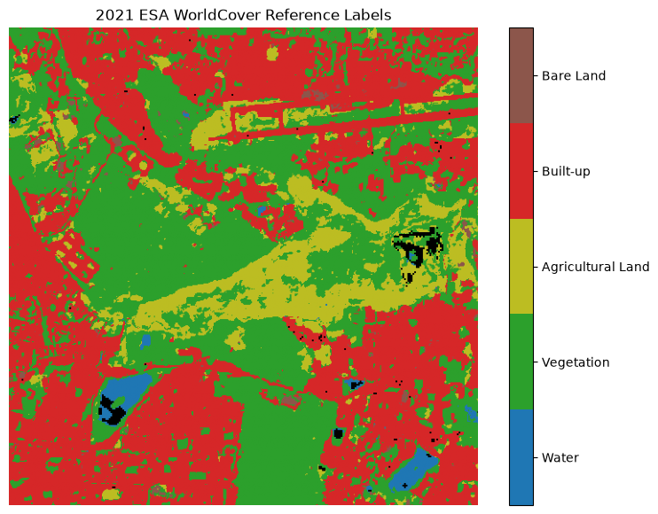
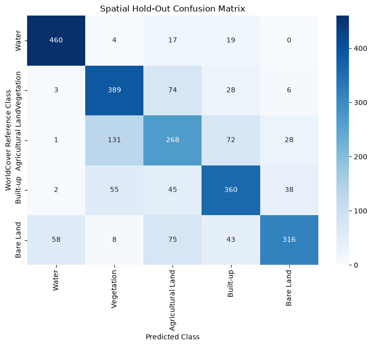
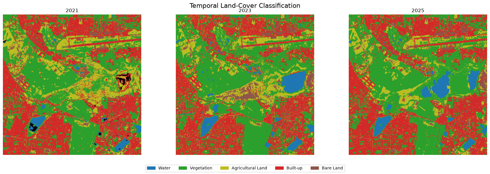
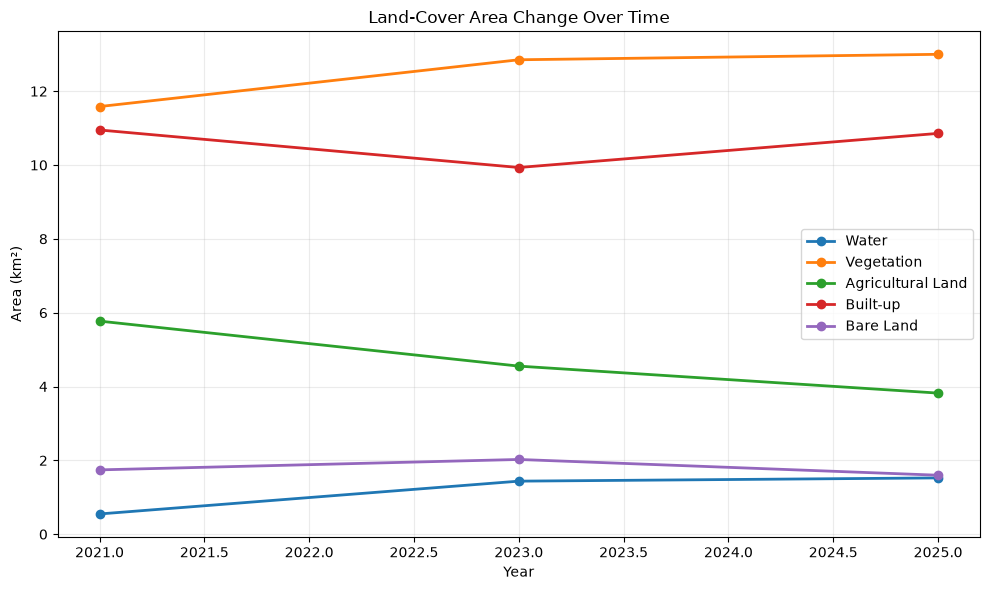
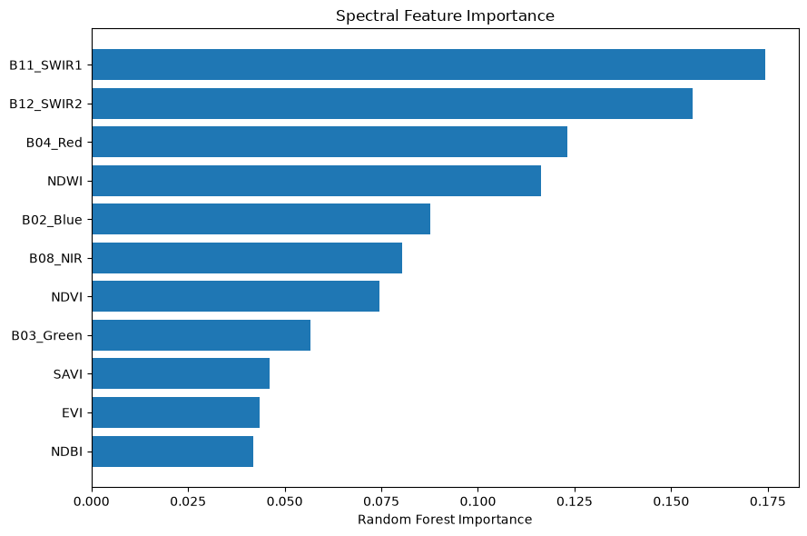

# Temporal Land-Cover Analysis

## Project Overview

This project performs temporal land-cover classification and change analysis for a fixed AOI in Bengaluru using Sentinel-2 imagery from 2021, 2023, and 2025.

The workflow uses ESA WorldCover 2021 as the reference dataset and a Random Forest classifier to classify five land-cover classes:

- Water
- Vegetation
- Agricultural Land
- Built-up
- Bare Land

The analysis includes image preprocessing, spectral feature extraction, spatial validation, land-cover classification, area estimation, and temporal change analysis.

## Approach

1. Selected Sentinel-2 Level-2A imagery for the study area for 2021, 2023, and 2025.
2. Reprojected the imagery to a common 10 m UTM grid.
3. Applied quality masking using the Sentinel-2 Scene Classification Layer.
4. Generated spectral bands and indices including NDVI, NDWI, NDBI, SAVI, and EVI.
5. Used ESA WorldCover 2021 as reference labels.
6. Trained a Random Forest classifier using a spatial train/validation split.
7. Evaluated the model using a spatial hold-out validation set.
8. Applied the trained model to all three years.
9. Compared class-wise land-cover area and analyzed 2021–2025 transitions.

## Key Results

The Random Forest classifier achieved:

- **Overall Accuracy:** 71.72%
- **Balanced Accuracy:** 71.72%
- **Macro F1:** 71.56%

SWIR1, SWIR2, Red, and NDWI were among the most important features for classification.

The temporal analysis estimates changes in the distribution of land-cover classes between 2021 and 2025. Since the model is trained using 2021 reference labels, the 2023 and 2025 results are treated as model-derived estimates rather than independently validated ground truth.

## Execution

### Requirements

Python 3.x with the following main packages:

```text
numpy
pandas
matplotlib
seaborn
rasterio
odc-stac
pystac-client
planetary-computer
scikit-learn
```

Run the notebook from start to finish to reproduce the analysis and generate the results.

## Visual Outputs

The following visualizations were generated from the analysis and are included in the `outputs/` folder.

### 1. ESA WorldCover 2021 Reference Labels



The 2021 ESA WorldCover map provides the reference labels used for training and spatial validation. The original WorldCover classes were mapped to the five project classes: Water, Vegetation, Agricultural Land, Built-up, and Bare Land.

### 2. Spatial Hold-Out Confusion Matrix



The confusion matrix shows the Random Forest classification performance on the spatially held-out validation blocks. The model achieved 71.72% overall accuracy and 71.56% macro F1.

### 3. Temporal Land-Cover Classification



The classification maps show the estimated spatial distribution of the five land-cover classes for 2021, 2023, and 2025 using the same trained Random Forest model.

### 4. Land-Cover Area Change Over Time



The plot compares the estimated area of each land-cover class across 2021, 2023, and 2025, allowing temporal changes within the selected AOI to be examined.

### 5. Spectral Feature Importance



The feature-importance plot shows the relative contribution of the spectral bands and indices used by the Random Forest classifier. SWIR1, SWIR2, Red, and NDWI were among the most important features.

## Research Papers and References

- Breiman, L. (2001). *Random Forests*. Machine Learning, 45, 5–32.
- Drusch, M. et al. (2012). *Sentinel-2: ESA's Optical High-Resolution Mission for GMES Operational Services*. Remote Sensing of Environment, 120, 25–36.
- ESA WorldCover 2021 — 10 m global land-cover dataset.
